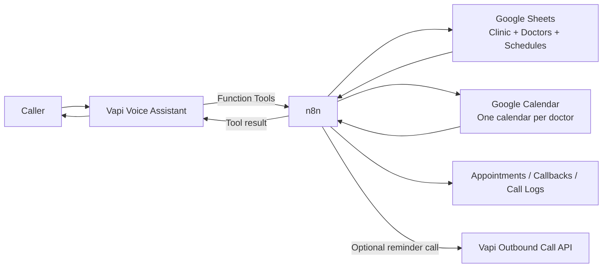
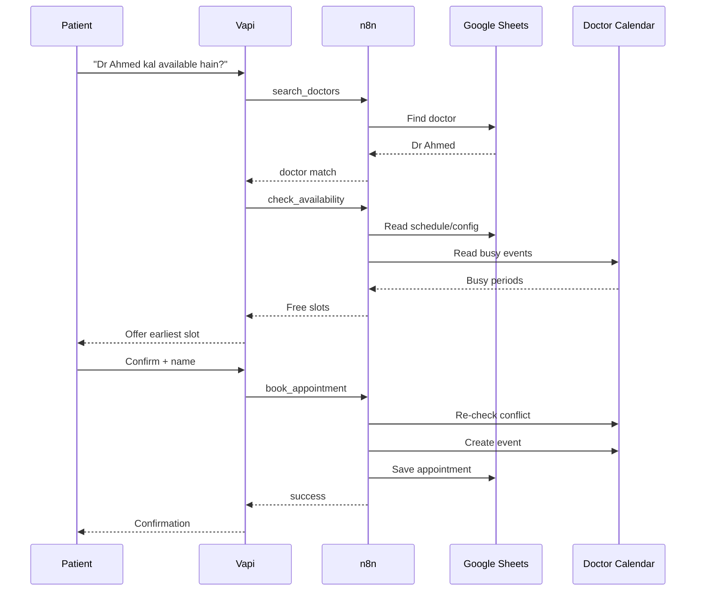

# 🩺 Clinic Appointment — AI Receptionist Agent

> **Vapi + n8n + Google Sheets + Google Calendar** voice receptionist for Pakistani clinics — designed for both single-doctor clinics and multi-doctor practices.

This agent answers inbound calls, understands **English, Urdu, and Urdu-English mix**, finds doctors by name or specialization, checks live availability, books **10-minute appointments**, looks up existing appointments, reschedules/cancels them, answers clinic FAQs, records callback requests, logs completed calls, and can place reminder calls.

---

## ✨ What this agent can do

| Capability | Status |
|---|---:|
| English + Pakistani Urdu conversation | ✅ |
| Doctor search by name / alias | ✅ |
| Search by specialization | ✅ |
| Multi-doctor support | ✅ |
| Separate calendar per doctor | ✅ |
| 10-minute appointment slots | ✅ |
| Split doctor shifts | ✅ |
| Doctor weekly off / one-off leave | ✅ |
| Clinic closed days / holidays | ✅ |
| Live calendar conflict checking | ✅ |
| Appointment booking | ✅ |
| Existing appointment lookup | ✅ |
| Reschedule | ✅ |
| Cancellation | ✅ |
| Clinic FAQ answers | ✅ |
| Human callback queue | ✅ |
| Call-end logging | ✅ |
| Optional outbound reminder calls | ✅ |
| Medical diagnosis / prescription | ❌ — deliberately blocked |

---

## 🧠 Architecture



### Why one Google Calendar per doctor?
Two different doctors can both see patients at **6:00 PM**. A shared calendar would incorrectly make one doctor's appointment block another doctor. Each doctor therefore has their own `calendar_id` in the `Doctors` sheet.

---

## 📁 Folder contents

```text
clinic-appointment/
├── README.md
├── .env.example
├── docker-compose.example.yml
├── workflow/
│   └── clinic-appointment-agent.json     # Import into n8n
├── vapi/
│   ├── system-prompt.txt                 # Paste into Vapi Assistant system prompt
│   └── tools.json                        # Vapi Function Tool schemas/reference
└── tests/
    └── workflow-tests.js                  # Static/logic test suite
```

> The workflow committed here is a **portable/sanitized GitHub build**. It does not contain Google OAuth secrets or a real Google Sheet ID.

---

# 🚀 Start-to-finish setup

## 1) Run n8n locally with Docker

If n8n is already running on `http://localhost:5678`, you can skip to **Step 2**.

Copy the example files:

```bash
cp .env.example .env
cp docker-compose.example.yml docker-compose.yml
```

Edit `.env` and at minimum set:

```env
TZ=Asia/Karachi
GENERIC_TIMEZONE=Asia/Karachi
CLINIC_GOOGLE_SHEET_ID=YOUR_GOOGLE_SHEET_ID
N8N_PUBLIC_URL=https://YOUR_PUBLIC_N8N_DOMAIN
N8N_ENCRYPTION_KEY=YOUR_OWN_LONG_RANDOM_SECRET
```

Start n8n:

```bash
docker compose up -d
```

Open:

```text
http://localhost:5678
```

### If you already have an n8n Docker container
You do **not** need to rebuild everything. Add the required environment variables to your current container/Compose file and restart it.

---

## 2) Give Vapi access to local n8n

Vapi runs in the cloud, so this will **not** work:

```text
http://localhost:5678/webhook/...
```

Vapi needs a public HTTPS URL that forwards to your local n8n.

### Fast development option — Cloudflare quick tunnel

```bash
cloudflared tunnel --url http://localhost:5678
```

Cloudflare will print a temporary HTTPS address similar to:

```text
https://example-name.trycloudflare.com
```

Use that as `YOUR_PUBLIC_N8N_DOMAIN` while testing.

> A quick-tunnel URL can change after restart. For a clinic going live, use a **named Cloudflare Tunnel + your own subdomain**, for example `https://n8n.yourdomain.com`.

Your public flow becomes:

```text
Vapi Cloud
   ↓
https://n8n.yourdomain.com
   ↓
Cloudflare Tunnel
   ↓
localhost:5678
   ↓
n8n Docker
```

---

## 3) Create the Google Sheet

Create one Google Spreadsheet and create these tabs **with the exact names and columns below**.

### `Clinic Config`

```text
clinic_name | address | phone | working_hours | open_time | close_time | timezone | closed_days | holidays | minimum_notice_minutes | default_slot_minutes
```

Recommended first row:

```text
My Clinic | Faisalabad | 041-XXXXXXX | Mon-Sat | 09:00 | 21:00 | Asia/Karachi | sunday | 2026-12-25 | 15 | 10
```

Important fields:
- `timezone`: use `Asia/Karachi`
- `minimum_notice_minutes`: recommended `15`
- `default_slot_minutes`: `10`
- `closed_days`: comma separated, for example `friday,sunday`
- `holidays`: comma-separated `YYYY-MM-DD` dates

### `Doctors`

```text
doctor_id | doctor_name | aliases | specialization | sub_specialization | qualification | gender | fee | branch | calendar_id | slot_minutes | off_dates | status
```

Example:

```text
D001 | Dr Ahmed Ali | Ahmed,Dr Ahmed | Cardiology | Interventional Cardiology | MBBS,FCPS | Male | 3000 | Main | YOUR_DOCTOR_CALENDAR_ID | 10 | 2026-09-20,2026-09-21 | active
```

Use one unique `doctor_id` per doctor.

`aliases` helps callers who say a shorter name, for example:

```text
Ahmed,Dr Ahmed,Ahmed Sahib
```

### `Doctor Schedules`

```text
doctor_id | day | start_time | end_time | slot_minutes | active
```

Example split shift:

```text
D001 | monday | 10:00 | 13:00 | 10 | yes
D001 | monday | 17:00 | 21:00 | 10 | yes
```

For a 10-minute shift, n8n produces:

```text
17:00  17:10  17:20  17:30  17:40 ...
```

It rejects off-grid requests such as `18:07`, and rejects a slot that would cross the doctor's shift closing time.

### `Appointments`

```text
appointment_id | calendar_event_id | doctor_id | doctor_name | patient_name | phone | date | time | slot_minutes | status | reason | language | created_at | updated_at | reminder_sent
```

### `FAQ`

```text
topic | keywords | answer_en | answer_ur
```

Example:

```text
fee | fee,charges,فیس | Dr Ahmed's consultation fee is PKR 3000. | Dr Ahmed کی consultation fee تین ہزار روپے ہے۔
```

Only put **administrative clinic information** here. Do not use the FAQ as a medical-advice database.

### `Callbacks`

```text
callback_id | name | phone | reason | requested_at | status
```

### `Call Logs`

```text
call_id | phone | started_at | ended_at | duration_sec | transcript | recording_url | outcome | summary
```

---

## 4) Create one Google Calendar per doctor

For each doctor:

1. Create a separate Google Calendar.
2. Copy its Calendar ID from Google Calendar settings.
3. Paste that ID into the doctor's `calendar_id` field in the `Doctors` sheet.
4. Make sure the Google account connected to n8n can read/write that calendar.

Example:

```text
Dr Ahmed → dr-ahmed-calendar-id
Dr Sara  → dr-sara-calendar-id
Dr Usman → dr-usman-calendar-id
```

---

## 5) Configure Google credentials in n8n

The GitHub workflow intentionally contains **credential stubs only**.

In n8n create/connect:

- **Google Sheets OAuth2** credential
- **Google Calendar OAuth2** credential

For Google OAuth, use the exact redirect/callback URL displayed by your n8n credential screen in Google Cloud Console. Do not copy a callback URL from another n8n instance.

After importing the workflow, reconnect the Google Sheets and Google Calendar nodes to your credentials.

> The workflow reads the spreadsheet ID from `$env.CLINIC_GOOGLE_SHEET_ID`, so you do not need to hard-code your real Sheet ID into the public workflow JSON.

---

## 6) Import the workflow into n8n

In n8n:

```text
Workflows
→ Import from File
→ workflow/clinic-appointment-agent.json
```

The complete agent is stored as **one n8n workflow**.

After import:

1. Confirm timezone is `Asia/Karachi`.
2. Reconnect Google Sheets credentials.
3. Reconnect Google Calendar credentials.
4. Verify `CLINIC_GOOGLE_SHEET_ID` is available inside the n8n container.
5. Keep the workflow **inactive** until the first manual checks are complete.

To confirm the environment variable from the container side:

```bash
docker exec n8n printenv CLINIC_GOOGLE_SHEET_ID
```

---

# 🔌 n8n webhook map

Once the workflow is active, these are the **production** endpoints:

| Vapi Tool | n8n endpoint |
|---|---|
| `search_doctors` | `/webhook/search-doctors` |
| `check_availability` | `/webhook/check-availability` |
| `book_appointment` | `/webhook/book-appointment` |
| `lookup_appointment` | `/webhook/lookup-appointment` |
| `reschedule_appointment` | `/webhook/reschedule-appointment` |
| `cancel_appointment` | `/webhook/cancel-appointment` |
| `answer_question` | `/webhook/answer-question` |
| `request_callback` | `/webhook/request-callback` |
| Optional `clinic_info` | `/webhook/clinic-info` |
| Vapi end-of-call report | `/webhook/call-ended` |

Example with a tunnel/domain:

```text
https://YOUR_PUBLIC_N8N_DOMAIN/webhook/check-availability
```

### `/webhook` vs `/webhook-test`

Use:

```text
/webhook-test/...
```

only while manually listening for a test event in n8n.

For Vapi's saved/live tools, **activate the workflow** and use:

```text
/webhook/...
```

---

# ☎️ Vapi setup

## 7) Create the Vapi Assistant

Create one Assistant in Vapi and paste:

```text
vapi/system-prompt.txt
```

into the Assistant's **System Prompt**.

Recommended behavior:

- Female receptionist voice
- Multilingual STT/TTS that handles Pakistani Urdu names and times well
- Low/moderate temperature for reliable tool usage
- Prefer **Assistant waits for user** for the first turn, so the caller's language can be detected before the receptionist replies

The assistant mirrors the caller:

```text
English caller → English
Urdu caller → natural Pakistani Urdu
Urdu-English mix → natural Urdu-English mix
```

Urdu words are written in Urdu script in the prompt because speech engines generally pronounce them more reliably than Roman Urdu.

---

## 8) Create/attach the Vapi Function Tools

`vapi/tools.json` contains the exact schemas/reference for these tools:

1. `search_doctors`
2. `check_availability`
3. `book_appointment`
4. `lookup_appointment`
5. `reschedule_appointment`
6. `cancel_appointment`
7. `answer_question`
8. `request_callback`

Replace:

```text
YOUR_PUBLIC_N8N_DOMAIN
```

with the public HTTPS hostname that reaches your Docker n8n.

### Tool purpose and required information

| Tool | What it does | Main arguments |
|---|---|---|
| `search_doctors` | Finds doctor by name/specialization/branch/gender | doctor_name, specialization, branch, gender, language |
| `check_availability` | Returns real free slots for one doctor/date | doctor_name, date, language |
| `book_appointment` | Validates and books a slot | patient_name, doctor_name, date, time, phone, reason, language |
| `lookup_appointment` | Finds caller's active appointment | phone, date, doctor_name, language |
| `reschedule_appointment` | Moves an existing appointment | appointment_id/old details + new date/time |
| `cancel_appointment` | Cancels one confirmed appointment | appointment_id/details + phone |
| `answer_question` | Answers administrative clinic FAQs | question, language |
| `request_callback` | Adds caller to callback queue | name, phone, reason, language |

The n8n Function Tool response is returned as:

```json
{
  "results": [
    {
      "toolCallId": "same-id-from-vapi",
      "result": "{\"status\":\"success\",\"message\":\"...\"}"
    }
  ]
}
```

The `result` is deliberately a **single-line JSON string**. The assistant parses it; it should never read raw JSON to the caller.

---

## 9) Add Vapi built-in End Call

Attach Vapi's built-in **End Call** tool to the assistant.

`endCall` does **not** need an n8n webhook.

The assistant uses it when:
- caller says goodbye / call is finished
- urgent emergency safety response has been delivered
- a completed workflow has been closed naturally

---

## 10) Configure call-end logging

Configure Vapi's assistant/server events so an **end-of-call report** is sent to:

```text
https://YOUR_PUBLIC_N8N_DOMAIN/webhook/call-ended
```

The workflow can store:

- caller number
- call ID
- start/end time
- duration
- transcript
- recording URL
- outcome / summary

⚠️ Decide your clinic's consent, retention, and privacy policy before storing recordings or transcripts in production.

---

# 🗣️ Example calls

### Doctor by name

```text
Caller: Dr Usman available hain aaj?
Agent:  [search_doctors → check_availability]
Agent:  Dr Usman ka aaj sab se pehla slot شام چھ بج کر دس منٹ پر ہے — ٹھیک ہے؟
```

### By specialization

```text
Caller: Skin ka doctor kon hai?
Agent:  [search_doctors specialization=Dermatology]
Agent:  Clinic mein Dr Sara aur Dr Ali Dermatology ke liye available hain. Kis doctor ke liye appointment chahiye?
```

### English caller

```text
Caller: Is Dr Ahmed available tomorrow?
Agent:  [search_doctors → check_availability]
Agent:  Dr Ahmed's earliest slot tomorrow is 6:20 PM — is that okay?
```

### Booking

```text
Caller: Haan, 6:20 theek hai.
Agent:  Patient ka naam?
Caller: Hassan Ali.
Agent:  [book_appointment]
Agent:  Ho gaya, Dr Ahmed ke saath kal 6:20 PM par appointment confirm hai. Shukriya.
```

---

# ⏰ Optional reminder calls

The workflow contains a daily reminder branch for tomorrow's appointments.

Set these environment variables only if you want this feature:

```env
VAPI_PRIVATE_KEY=...
VAPI_REMINDER_ASSISTANT_ID=...
VAPI_PHONE_NUMBER_ID=...
```

The reminder branch calls Vapi's outbound call API and marks the appointment as reminded.

**Recommendation:** keep the reminder branch disabled/disconnected until inbound booking, rescheduling, and cancellation have all passed live tests.

---

# ✅ Bring the agent live — deployment checklist

Run these in order:

- [ ] n8n opens at `http://localhost:5678`
- [ ] public HTTPS tunnel/domain reaches n8n
- [ ] `CLINIC_GOOGLE_SHEET_ID` exists in Docker environment
- [ ] all required Google Sheet tabs/columns exist
- [ ] at least one doctor exists in `Doctors`
- [ ] doctor has a valid `calendar_id`
- [ ] doctor's schedule exists in `Doctor Schedules`
- [ ] Google Sheets OAuth works in n8n
- [ ] Google Calendar OAuth works in n8n
- [ ] n8n workflow imported successfully
- [ ] Vapi System Prompt pasted
- [ ] all eight Function Tools attached
- [ ] each tool uses the public `/webhook/...` URL
- [ ] Vapi built-in End Call attached
- [ ] workflow activated

Then run this smoke test:

1. Search a known doctor by exact name.
2. Search a known specialization.
3. Check today's availability.
4. Book a test patient on a valid 10-minute boundary.
5. Check availability again — the booked slot should disappear.
6. Try the same patient/doctor/day again — duplicate handling should trigger.
7. Look up the appointment.
8. Reschedule it.
9. Cancel it.
10. Check the `Appointments` sheet and doctor calendar.
11. Make one Urdu call.
12. Make one English call.
13. Confirm the end-of-call log arrives.
14. Only then enable reminder calls.

---

# 🧪 Tests

The workflow was checked with a static/logic test suite covering:

- current Vapi tool payload parsing
- older Vapi tool payload compatibility
- Pakistan phone normalization
- specialization search
- clinic closed day
- doctor one-off leave date
- next scheduled date
- 10-minute slot acceptance
- invalid `18:07` rejection
- shift-end overlap rejection
- occupied Google Calendar slot exclusion
- duplicate/retried Vapi tool-call handling
- duplicate patient/day/doctor detection
- calendar overlap detection
- Vapi response envelope
- workflow graph integrity
- unique webhook paths

The delivered build passed **17/17 static/logic checks** before publishing. Real Google/Vapi credentials must still be tested on the deployment instance.

---

# 🛡️ Medical and privacy boundaries

This assistant is a **receptionist**, not a medical professional.

It must not:

- diagnose symptoms
- prescribe medicines
- suggest dosages
- interpret reports/tests
- tell a caller whether a condition is medically safe

For emergency symptoms configured in the prompt, the assistant directs the caller toward urgent in-person emergency care rather than trying to diagnose over the phone.

For production, review the legal/privacy requirements that apply to your clinic and country before storing patient call transcripts, recordings, or health-related information.

---

# ⚠️ Scaling note

This design is a strong MVP for small clinics and moderate multi-doctor deployments, but Google Calendar does not provide an atomic `reserve-if-still-free` transaction.

Two truly simultaneous callers could theoretically pass the conflict check before either Calendar event is created.

For large/hospital-scale deployment, add a transactional scheduling layer such as:

```text
PostgreSQL / Supabase
UNIQUE (doctor_id, start_time)
```

or use a scheduling service with slot reservation/transaction semantics.

The Vapi + n8n receptionist architecture can remain the same.

---

## 🧩 Typical production flow



---

### Built for the `Automation-Agents` repository

This folder is intentionally self-contained so additional automation agents can be added next to it later without mixing their workflows, prompts, or setup files.
